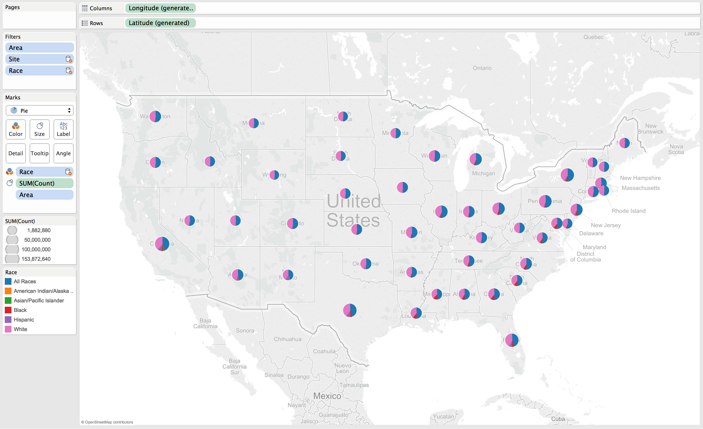

  Elements Of Data Visualization Final Project: Cancer Data Analysis
===
  __By Alex Cortez, Adam Hernandez, and Alex Pearce__

__GitHub__: https://github.com/ACollectionOfAtoms/DV_FinalProject

This data was provided by the Enigma.io database. It is described as such:
United States Cancer Statistics (USCS) information is aggregated from thousands of local cancer registries and published by the National Program of Cancer Registries (NPCR), a division of the Centers for Disease Control and Prevention (CDC).

## Load necessary packages
```{r message=FALSE}
source("../01 Data/load_packages.R",echo=TRUE)
```

## Dataframe Creations
```{r message=FALSE}
source("../01 Data/cancer_tables.R",echo=TRUE)
```

***

## An analysis of cancer, age, death, and incidence through data wrangling. 
```{r message=FALSE}
source("../02 Data Wrangling/general_age_analysis.R",echo=TRUE)
```

## Inspecting Age and Site
```{r message=FALSE}
source("../02 Data Wrangling/age_site.R",echo=TRUE)
```

## Some Data manipulation...
```{r message=FALSE}
source("../02 Data Wrangling/age_site2.R",echo=TRUE)
```

## Further analysis, introducing race. 
```{r message=FALSE}
source("../02 Data Wrangling/age_site3.R",echo=TRUE)
```

***
## Let's now focus on geography. Alaska and Hawaii have been left out to improve the aesthetics of the following visualizations.

## Comparing types of cancer occurance in each state
### Non-Hodgkin Lymphomas are by far the most common in each state. Interestingly, each state has very similar proportions of cancer types, leading one to believe that the form of cancer you are diagnosed with is not related to region.


## Comparing cancer occurance by race in each state.
### Notice how white people form the majority in every state, nearly equal in size to the section for all races.


## Comparing cancer occurance by racial minorities in each state
### Taking out white people and all races leaves us with minority categories. These statistics appear to follow the demographic ratios that are prevalent in these regions, with a more black concentrated South East and a more Hispanic concentration to the West. Apparently, minorities either do not exist or do not get cancer in the Central North.


***
## Let's take another look at the most common cancers.

## Common cancers
### Here is a circle chart comparing the proportion of cancer cases with each type of cancer. While the color is based on absolute count, the size is based on the percent occurance using the Count/Population calculated field below:


### Using this calculated field allows us to factor in the populations of each region in question and to summarize cancer occurance by these regional percentages.

### By percentage, lung, prostate, and breast cancers are very similar and in lead as the most common cancers. By count, however, lung cancer is far more prevalent.


## Common cancers by sex
### While female breast cancer and prostate cancer are leading forms of cancers in their respective sex groups, both sexes suffer second most from lung cancer.


## Common cancers by age
### As is common knowledge, cancer becomes a growing concern as one ages. It appears that Female Breast Cancer is one form of cancer that women must worry about for the majority of their lives.


## Common cancers by year
### Though the proportion of cancers to each other are staying constant, the number of cancer incidents are increasing, as indicated by the increasing darkness of lung cancer and breast cancer in particular.


***

## We will now focus on age range

## Types of cancers for ages by race and sex
### White people have the highest occurance of cancer by far, most likely because they are the most populous race in the United States, but several other factors are likely involved in these high numbers. If also appears that males start to be diagnosed with cancer more than women around ages 55-84


## Types of cancers for children by race and mortality
### Here are the cancers that children are diagnosed with and whether they are fatal or not. Thankfully, it appears that most children with cancer will recover. Early childhood is plagued by leukemias and brain cancers. It is not until age 15 that we begin to see a large variety of cancers such as thyroid, testicular, and melanomas.


## Types of cancer for females by race and mortality
### Age 35 is when females start to become increasingly diagnosed with cancer. Highlighted here are some of the more commonly associated female cancers. While breast cancer occurs the most, lung cancer is the most lethal.


## Types of cancer for males by race and mortality
### Males start to become increasingly diagnosed with cancer around age 55, where the most common to be diagnosed is prostate cancer. Like women, lung cancer is the most lethal for men, though prostate cancer becomes increasingly more lethal as the person gets older.
